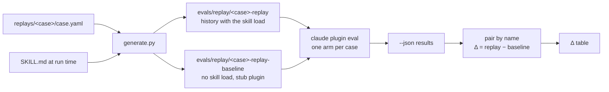
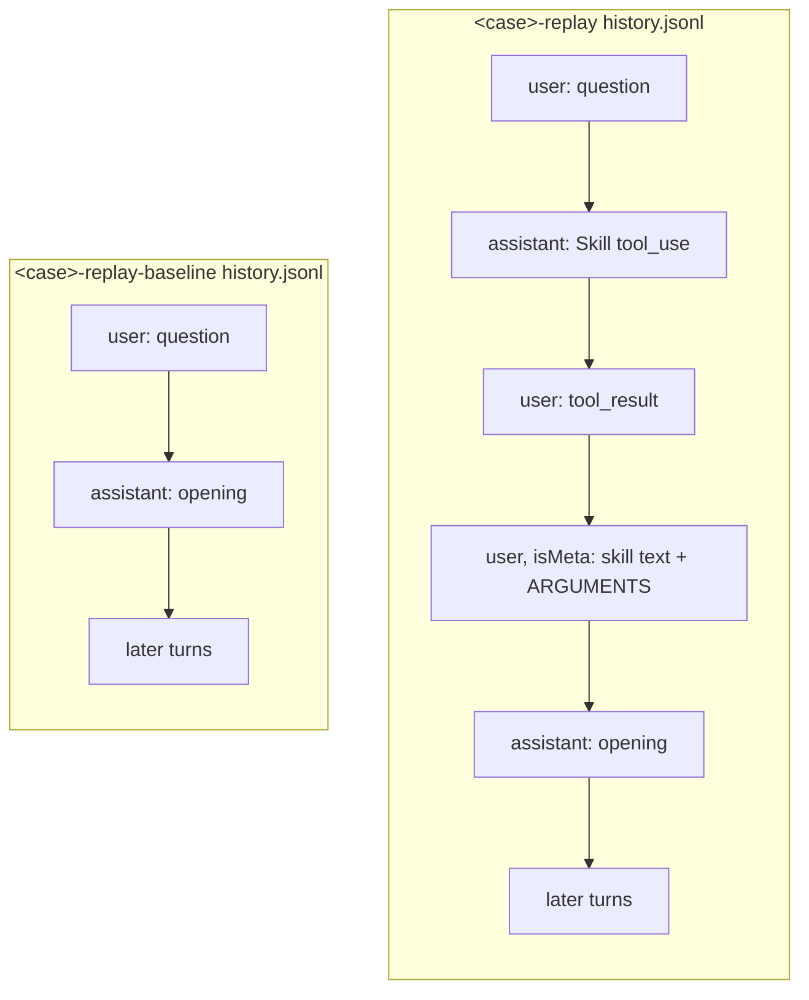
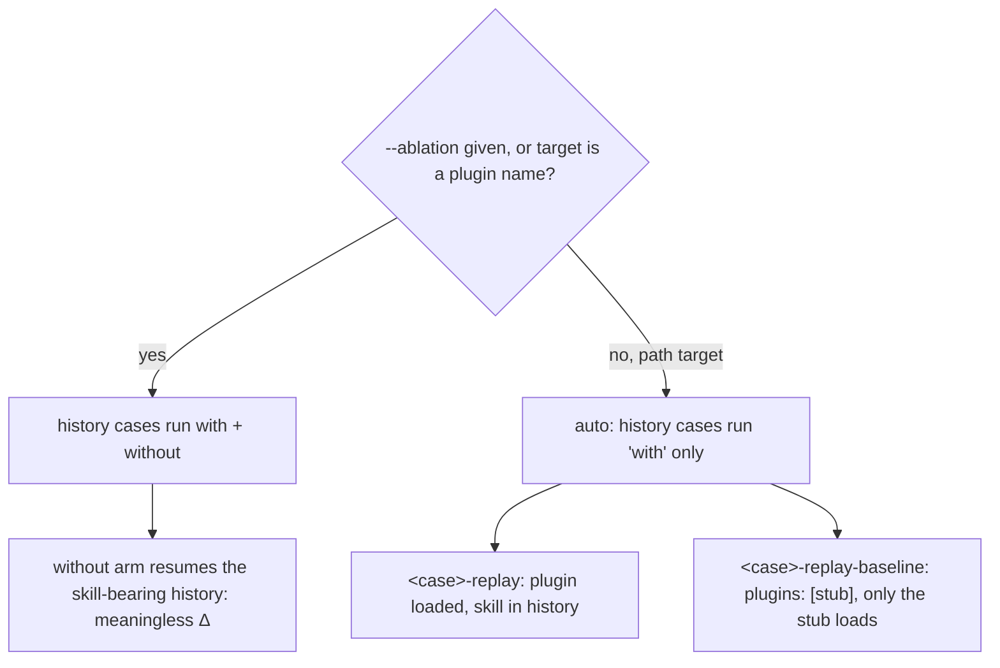

# Replay eval cases

## The problem

Later-turn cases in the what-the-heck suite must behave as if the skill
loaded at turn 1 and stayed in context, because that's how the skill
actually gets used. Two ways of faking that don't reproduce it.

Restating the earlier turns inside one prompt isn't a real conversation:
the model never actually held that context, it's just reading a
transcript pasted into its input, and a no-skill arm given that prompt
has no lesson to act in. It replies that it cannot see the earlier
conversation, or follows a route restated in its own prompt, so Δ
measures the restatement rather than the skill. Loading the skill by
slash command before the live prompt gets closer, but it's still not
the same event as a natural trigger: the whole prompt becomes the
skill's `ARGUMENTS`, and that changes what the model sees. On a
calibration answer that fits the route ("I'm about to start using CTEs
in our reports, and a colleague warned me they can make queries slow.
I haven't written one yet. Go ahead."), `20` with-arm runs each,
`claude-opus-5-5`, CLI 2.1.283:

| Loading | keeps-the-route |
| --- | --- |
| Slash command | 11/20 |
| Natural trigger | 19/20 |
| Replayed transcript | 20/20 |

A replayed transcript — a real `--resume` history with the skill already
loaded, generated fresh from the current `SKILL.md` — scores like a
natural trigger. That's what replay cases run.

### What `claude plugin eval` can't do on its own

The CLI can resume a case from earlier turns, but three gaps stop that
from giving a trustworthy Δ:

- **Nothing builds the transcript.** A case carries earlier turns only
  through `context.history_file`, a saved session transcript. A real
  saved session runs to roughly 900 KB, carries account IDs, `cwd` and
  `gitBranch` that need scrubbing, and holds the skill text as it was
  when the session ran, so it goes stale the moment `SKILL.md` changes.
- **The baseline can't strip the skill from a transcript.** `--ablation`
  accepts only `none` or `with-without`, and the with-without baseline
  arm drops the plugin but resumes the same transcript, skill text
  included. Both arms are taught by the skill, so the Δ means nothing.
  There is no without-only mode, and by default the CLI runs a history
  case single-arm, with no Δ at all.
- **Nothing pairs two cases.** The CLI computes Δ only between the two
  arms of one case. It has no way to say that one case is the baseline
  of another.

Replay cases fill those gaps: `generate.py` writes each transcript from
the current `SKILL.md` on every run, a baseline twin gets the same turns
without the skill load and with an empty stub plugin, and `scripts/eval.py`
pairs the two for Δ. Everything else (the sandbox, judging, the cost
ceiling, the report) is still the CLI's.

## What replay cases measure

3 runs per arm, `claude-opus-5-5` as model and judge, CLI 2.1.283:

| Case | With | Baseline | Δ |
| --- | --- | --- | --- |
| first-step | 0.92 | 0.25 | +0.67 |
| closing | 1.00 | 0.60 | +0.40 |
| shaky-reasoning-rechecks | 0.92 | 0.67 | +0.25 |
| wrong-answer-reteaches | 1.00 | 0.75 | +0.25 |
| next-means-one-step | 1.00 | 1.00 | 0.00 |
| first-step-route-fits | 1.00 | 1.00 | 0.00 |

- **The skill holds a lesson on a wrong or shaky answer; the baseline
  moves on.** In `wrong-answer-reteaches`, every baseline run corrects
  the learner and goes on to step 3, while every with-skill run
  re-teaches step 2 and asks a new check. In `shaky-reasoning-rechecks`,
  every baseline run names the gap in the learner's reasoning and then
  moves on, to step 3 or step 4, while every with-skill run re-checks
  and stays on step 2.
- **The closing recap is the skill's.** Nothing in the closing prompt
  asks for a recap. With the skill, every run gives the lesson back as a
  numbered chain of the five steps. The baseline closes with a summary
  table or advice to pass on to the colleague, and fails `causal-chain`
  in all three runs.
- **`first-step-route-fits` guards a rule rather than measuring it.**
  The learner answers only "Go ahead.", both arms keep the route and
  start at item 1, and Δ is 0.00. A calibration answer that carries any
  detail, such as a colleague's warning that CTEs are slow or being new
  to writing them, makes the skill revise the route, because it reads
  the detail as a change in what is worth teaching.
- **With the skill, the misses are single runs.** `first-step` misses
  two graders in one run: its check can be answered by quoting the
  step's "free to reorder" sentence, and its prose fails
  `no-extraneous-prose`. `shaky-reasoning-rechecks` misses one: its check
  asks how to find out whether a CTE was inlined, not something that
  tests the corrected reasoning.

Two limits apply when reading these numbers. The baseline copies the
skill's format from the earlier turns in its history (see Known
differences), which is why `next-means-one-step` shows 0.00. And
with 3 runs per arm, one grader changing its verdict in one run moves a
case's score by 0.04 to 0.17, depending on how many graders it has.

## How it works

Sources are generated into paired cases, one with the skill load in
history and one without:



The two transcripts differ only in whether the skill load happened:



The eval CLI's own arm selection decides how many arms a case runs. A
history case with a path target runs one arm by default; the CLI's
with-without would instead resume the same skill-bearing history for both
arms, which is meaningless here:



## The source format

Each replay case has one committed source,
`plugins/what-the-heck/replays/<case>/case.yaml`. It uses Claude Code's
`case.yaml` schema plus two proposed keys: `context.messages` and a
per-message `skill`.

```yaml
schema_version: "1.1"
name: first-step-route-fits-replay
context:
  messages:
    - role: user
      content: what the heck is a CTE?
    - role: assistant
      skill: {name: what-the-heck:what-the-heck, args: CTE}
      content: |
        A CTE is a named subquery you write at the top of a statement with `WITH`, ...

        1. A CTE is a named subquery the rest of the statement can refer to by name
        ...
        What prompted the question: did you run into a `WITH` in someone else's query, or are you trying to write one?
execution:
  model: claude-opus-5-5
  prompt: |
    Go ahead.
  max_turns: 6
  timeout_seconds: 300
  allowed_tools: [Skill]
runs: 3
graders:
  - name: keeps-the-route
    type: llm
    focus: last_message
    criteria: |
      ...
```

Rules:
- `messages` alternate user, assistant, starting with user and ending
  with assistant. `execution.prompt` is the live next turn, as in Claude
  Code today.
- `skill` marks the assistant turn that ran after the skill loaded. It
  may appear on one message only. The with-skill transcript inserts the
  load before that turn; the baseline drops it.
- Graders are inline, or in `graders/*.md` beside the source (both are
  Claude Code shapes). `arm: with-only` graders go into the `-replay`
  case only and are reported as indicators, not scored, the same way the
  CLI treats them under `with-without`. A `tool_used` grader on `Skill`
  is refused (see Guards).
- `content` is a string. Block lists (tool calls, images) are out of
  scope.
- The generated baseline is named `<name>-baseline`.

## Generated cases

Each source produces two case directories under
`plugins/what-the-heck/evals/replay/`:

```
evals/replay/
  first-step-route-fits-replay/
    case.yaml          context.history_file: history.jsonl; no plugins: key
    history.jsonl      with the skill load
  first-step-route-fits-replay-baseline/
    case.yaml          plugins: [stub]
    history.jsonl      same turns, no skill load
    stub/.claude-plugin/plugin.json
```

The generated `case.yaml` carries the source's `execution`, `runs` and
graders (inlined; the baseline gets every grader except `arm: with-only`
ones), drops `messages`, and adds `context.history_file`. The stub's
`plugin.json` is:

```json
{"name": "replay-baseline-stub", "version": "0.0.0", "description": "No skills. Stands in for the plugin under test in a replay baseline."}
```

The with-skill `history.jsonl` holds these records, in order:

1. `user`: the first user message, as string content.
2. `assistant`: one `tool_use` block calling `Skill`, with input
   `{skill, args}` from the source's `skill` entry.
3. `user`: the `tool_result` "Launching skill: &lt;name&gt;", with
   `toolUseResult` and `sourceToolAssistantUUID`.
4. `user`, `isMeta: true`, with `sourceToolUseID` and `turnCompanion`:
   `Base directory for this skill: <skill dir>`, the trimmed `SKILL.md`
   body and `ARGUMENTS: <args>`, byte-for-byte as the CLI builds it.
5. `assistant`: the text of the message marked `skill`, with
   `attributionSkill` and `attributionPlugin`.
6. The remaining messages, as plain `user` and `assistant` text records.
7. `last-prompt`, with `leafUuid` set to the last record's uuid.

The baseline transcript is the same with records 2–4 removed and no
attribution fields on record 5.

Every record in a transcript carries `uuid`, `parentUuid` (one chain),
`sessionId`, `cwd`, `version`, `gitBranch`, `userType`, `entrypoint`,
`isSidechain: false`. uuids, timestamps and the session id are generated
deterministically from the case name, so re-running the generator on
unchanged input gives identical files.

The directory is gitignored. Generated files stay after a run so they
can be inspected for debugging, and are wiped and rewritten at the start
of the next run. Committing them would mean linting them against
`SKILL.md` to catch staleness; regenerating on every run makes staleness
impossible instead.

## Running it

`uv run scripts/eval.py <plugin dir> [claude plugin eval options]` is the
wrapper. It regenerates every case pair, runs `claude plugin eval`, pairs
each `<name>` with `<name>-baseline`, and prints one Δ table (also
written as `delta.md` beside the `--json` output).

The wrapper refuses:

| Refused | Why |
| --- | --- |
| `--ablation` passed to the wrapper | `with-without` gives `<name>` a second arm that resumes a transcript carrying the skill text: a meaningless Δ, at double cost |
| A target that is not an existing directory | An installed plugin name also switches history cases to two arms |
| A `--case` glob that matches one side of a pair but not the other | A replay case without its baseline has no Δ |
| A source grader of type `tool_used` on tool `Skill` with `min` of 1 or more, such as `skill-fired` | A replay never calls Skill: the load is already in the history, so the grader could never pass. The generator stops with an error naming the grader; neither case is written |
| A source with no `skill` message, or more than one | The pair would not differ, or would not match a real session |
| Messages that do not alternate, start with user, or end with assistant | `--resume` needs a coherent chain, and `execution.prompt` is the next user turn |
| A generated name that collides with an existing case | Two cases with one name make results ambiguous |
| Results where a replay case has arms other than `with`, or a baseline loaded a skill | The one-arm assumption broke; the Δ would be wrong |

Where each runs in CI:
- **Source guards** (Skill `tool_used` grader, `skill` message count,
  message order, name collision) run on every PR through
  `generate.py --check` in `lint.yml`. Free, no secrets.
- **Argument guards** (`--ablation`, target, unpaired `--case` glob)
  apply to a wrapper invocation, not to repo state. `lint.yml` runs unit
  tests that call the wrapper's argument check with each refused input;
  no eval starts. They also apply live in `eval.yml`, which calls the
  wrapper.
- **The results guard** needs a real run, so it runs only in `eval.yml`.
  It reads the `--json` output; the baseline init-event check uses the
  kept trace when `--keep-temp` is passed and is skipped otherwise.

## Capturing turns

Earlier assistant turns are captured once from a real run, not
hand-written and not captured live on every eval run. `capture.py` reads
a `capture.yaml` file — `skill: <plugin>:<skill>`, `model:`, and
`messages:` ending on a user turn — runs that last turn through the eval
sandbox, and appends the reply as an assistant turn. The first captured
reply gets a `skill: {name, args}` entry with the args the model actually
used.

Captured text is then edited to the canonical route: the earlier turn a
real run produces isn't always the turn the case should pin, so the
capture is corrected before it becomes source.

### How to capture a lesson

The what-the-heck lesson lives in `plugins/what-the-heck/replays/_lesson.yaml`.
It is not a source (the generator reads only `replays/*/case.yaml`); it is
the working file the six sources are cut from.

**1. Start the file with the first user turn.** You write every user turn;
`capture.py` only ever adds assistant turns.

```yaml
skill: what-the-heck:what-the-heck
model: claude-opus-5-5
messages:
  - role: user
    content: what the heck is a CTE?
```

**2. Run the capture.**

```
uv run scripts/evals/capture.py plugins/what-the-heck plugins/what-the-heck/replays/_lesson.yaml
```

It builds a one-case eval in `plugins/what-the-heck/replay-capture/`
(gitignored, wiped on the next run): the last user turn becomes the
case's prompt, and the earlier turns, if any, become its `history.jsonl`.
It runs that case once with `claude plugin eval`, reads the reply from the
run's trace, appends it to `_lesson.yaml` as an assistant turn, and prints
it. The eval sandbox keeps your own `CLAUDE.md` and settings out of the
reply.

On the first run there is no history, so the skill has to load on its own.
The appended turn records the `args` the model passed to the Skill tool:

```yaml
  - role: assistant
    skill:
      name: what-the-heck:what-the-heck
      args: CTE
    content: |-
      **Short answer:** A CTE (Common Table Expression) is ...
```

If the skill does not load, it retries, up to three attempts. Each run is
capped at $1, so the first turn can cost up to $3 and each later turn up
to $1.

**3. Read the reply and fix it before going on.** The next run resumes a
transcript built from the whole file, so whatever the file says, the model
believes it said. A reply that drifts from the route (skips a step, renames
the route, renumbers "Step 3 of 4") would carry that drift into every later
turn. Edit the reply in place until it teaches the route item it should.

**4. Add the next user turn by hand, then run step 2 again.** For example,
the calibration reply:

```yaml
  - role: user
    content: I'm about to start using CTEs in our reports, and a colleague warned me ...
```

`capture.py` refuses to run while the file ends on an assistant turn. Repeat
steps 2 to 4 until the lesson reaches the last turn a case needs.

**5. Cut the sources from the finished lesson.** Each source's
`context.messages` is a copy of the first turns of `_lesson.yaml`, keeping
the `skill` entry on the opening. Its `execution.prompt` is that case's own
next learner turn. For the six what-the-heck sources:

| Source | Turns copied from `_lesson.yaml` | Live prompt |
| --- | --- | --- |
| `first-step`, `first-step-route-fits` | the first 2 (question, opening) | each case's calibration reply |
| `next-means-one-step`, `shaky-reasoning-rechecks`, `wrong-answer-reteaches` | the first 6 (through step 2) | `next`, or the learner's answer to step 2's check |
| `closing` | all 12 (through step 5) | the learner's answer to step 5's check |

Put the graders in `replays/<case>/graders/`, then run
`uv run scripts/evals/generate.py --check`.

The copies are not linked. An edit in `_lesson.yaml` changes no replay case,
and an edit in a source does not flow back. To change a turn, edit it in
every source whose slice includes it, and in `_lesson.yaml` too so the next
re-capture starts from the same text.

## Decisions

**Transcripts generated at run time, not committed and linted.**
Committing them would need a staleness lint against `SKILL.md`.
Regenerating on every run makes staleness impossible instead.

**A paired baseline, not the CLI's with-without.** No without-only mode
exists; with-without resumes the same skill-bearing history for both
arms, which gives a meaningless Δ.

**The stub inside each baseline's case dir.** The CLI refuses a shared
plugin dir under the eval dir; each case dir gets its own.

**Wrap `claude plugin eval`, don't re-implement the runner.** The runner
already handles the sandbox, judge, cost ceiling and report.

**A `case.yaml`-shaped YAML source, not Markdown with markers.** It
reuses Claude Code's own case schema plus two keys, instead of inventing
a parallel format.

**With-only graders kept, scored as indicators; only a Skill-call check
is refused.** A replay never calls Skill, so that one grader could never
pass; other with-only graders still carry information about the with arm.

**Earlier turns captured and edited, not hand-written or captured live on
each run.** A real reply anchors the transcript; editing it fixes drift
without re-running the sandbox on every eval.

**Later turns are tested only by replay cases, not restated prompts.** A
restated prompt gives the baseline no conversation to act in (see The
problem). A turn-1 case (`opening`, the `no-trigger-*` cases) needs no
history and is a normal case.

## Known differences from real use

- **No earlier thinking.** Real saved assistant turns carry a thinking
  block with empty text and an encrypted signature (900–3,600
  characters). Generated turns carry none; valid signatures can't be
  made. Whether a real session sends earlier signatures back to the API
  is unresolved. New replies still think.
- **The baseline sees skill-shaped history.** Its earlier assistant turns
  were written with the skill loaded, so it can copy their format without
  the rules. This inflates the baseline and shrinks Δ. Accepted.
- **Earlier turns are fixed text.** A real learner sees whatever the
  model wrote at turn 1; replay cases always see the captured, edited
  version.
- **Environment records are dropped.** CLAUDE.md, memory, hook and cost
  records from a real session are not in the transcript. The eval sandbox
  has no user CLAUDE.md either.
- **The skill directory path** in the injected text is the path the
  generator ran from, not an installed plugin cache path. The skill never
  reads files, so this does not change what it teaches.
