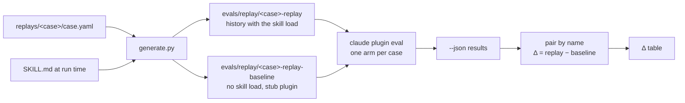
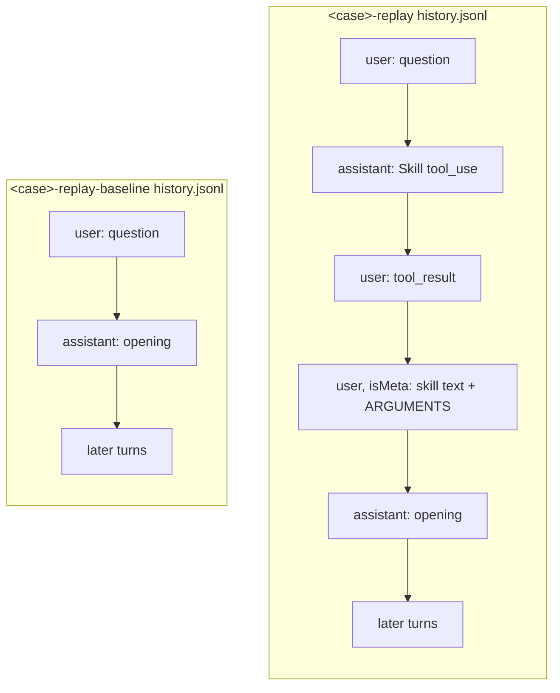
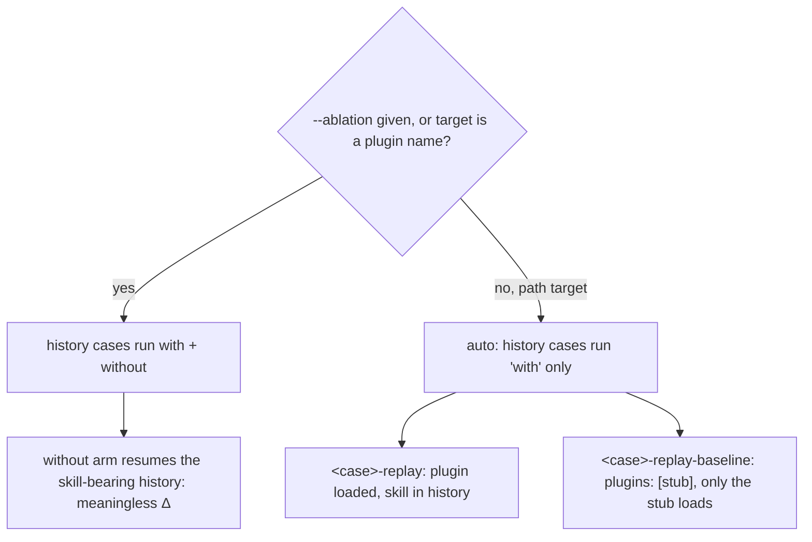

# Replay eval cases

## The problem

Later-turn cases in the what-the-heck suite must behave as if the skill
loaded at turn 1 and stayed in context, because that's how the skill
actually gets used. Two ways of faking that don't reproduce it.

Restating the earlier turns inside one prompt isn't a real conversation:
the model never actually held that context, it's just reading a
transcript pasted into its input. Loading the skill by slash command
before the live prompt gets closer, but it's still not the same event as
a natural trigger: the whole prompt becomes the skill's `ARGUMENTS`, and
that changes what the model sees. On `first-step-route-fits`, `20`
with-arm runs each, `claude-opus-5-5`, CLI 2.1.283:

| Loading | keeps-the-route |
| --- | --- |
| Slash command | 11/20 |
| Natural trigger | 19/20 |
| Replayed transcript | 20/20 |

A replayed transcript — a real `--resume` history with the skill already
loaded, generated fresh from the current `SKILL.md` — scores like a
natural trigger. That's what replay cases run.

## How it works

Sources are generated into paired cases, one with the skill load in
history and one without:



The two transcripts differ only in whether the skill load happened:



The eval CLI's own arm selection decides how many arms a case runs. A
history case with a path target runs one arm by default; the CLI's
with-without would instead resume the same skill-bearing history for both
arms, which is meaningless here:



## The source format

Each replay case has one committed source,
`plugins/what-the-heck/replays/<case>/case.yaml`. It uses Claude Code's
`case.yaml` schema plus two proposed keys: `context.messages` and a
per-message `skill`.

```yaml
schema_version: "1.1"
name: first-step-route-fits-replay
context:
  messages:
    - role: user
      content: what the heck is a CTE?
    - role: assistant
      skill: {name: what-the-heck:what-the-heck, args: CTE}
      content: |
        A CTE is a named subquery you write at the top of a statement with `WITH`, ...

        1. A CTE is a named subquery the rest of the statement can refer to by name
        ...
        What prompted the question: did you run into a `WITH` in someone else's query, or are you trying to write one?
execution:
  model: claude-opus-5-5
  prompt: |
    I'm about to start using CTEs in our reports, ... Go ahead.
  max_turns: 6
  timeout_seconds: 300
  allowed_tools: [Skill]
runs: 3
graders:
  - name: keeps-the-route
    type: llm
    focus: last_message
    criteria: |
      ...
```

Rules:
- `messages` alternate user, assistant, starting with user and ending
  with assistant. `execution.prompt` is the live next turn, as in Claude
  Code today.
- `skill` marks the assistant turn that ran after the skill loaded. It
  may appear on one message only. The with-skill transcript inserts the
  load before that turn; the baseline drops it.
- Graders are inline, or in `graders/*.md` beside the source (both are
  Claude Code shapes). `arm: with-only` graders go into the `-replay`
  case only and are reported as indicators, not scored, the same way the
  CLI treats them under `with-without`. A `tool_used` grader on `Skill`
  is refused (see Guards).
- `content` is a string. Block lists (tool calls, images) are out of
  scope.
- The generated baseline is named `<name>-baseline`.

## Generated cases

Each source produces two case directories under
`plugins/what-the-heck/evals/replay/`:

```
evals/replay/
  first-step-route-fits-replay/
    case.yaml          context.history_file: history.jsonl; no plugins: key
    history.jsonl      with the skill load
  first-step-route-fits-replay-baseline/
    case.yaml          plugins: [stub]
    history.jsonl      same turns, no skill load
    stub/.claude-plugin/plugin.json
```

The generated `case.yaml` carries the source's `execution`, `runs` and
graders (inlined; the baseline gets every grader except `arm: with-only`
ones), drops `messages`, and adds `context.history_file`.

Every record in a transcript carries `uuid`, `parentUuid` (one chain),
`sessionId`, `cwd`, `version`, `gitBranch`, `userType`, `entrypoint`,
`isSidechain: false`. uuids, timestamps and the session id are generated
deterministically from the case name, so re-running the generator on
unchanged input gives identical files.

The directory is gitignored. Generated files stay after a run so they
can be inspected for debugging, and are wiped and rewritten at the start
of the next run. Committing them would mean linting them against
`SKILL.md` to catch staleness; regenerating on every run makes staleness
impossible instead.

## Running it

`uv run scripts/eval.py <plugin dir> [claude plugin eval options]` is the
wrapper. It regenerates every case pair, runs `claude plugin eval`, pairs
each `<name>` with `<name>-baseline`, and prints one Δ table (also
written as `delta.md` beside the `--json` output).

The wrapper refuses:

| Refused | Why |
| --- | --- |
| `--ablation` passed to the wrapper | `with-without` gives `<name>` a second arm that resumes a transcript carrying the skill text: a meaningless Δ, at double cost |
| A target that is not an existing directory | An installed plugin name also switches history cases to two arms |
| A `--case` glob that matches one side of a pair but not the other | A replay case without its baseline has no Δ |
| A source grader of type `tool_used` on tool `Skill` with `min` of 1 or more | A replay never calls Skill: the load is already in the history. The grader could never pass |
| A source with no `skill` message, or more than one | The pair would not differ, or would not match a real session |
| Messages that do not alternate, start with user, or end with assistant | `--resume` needs a coherent chain, and `execution.prompt` is the next user turn |
| A generated name that collides with an existing case | The old cases stay during migration |
| Results where a replay case has arms other than `with`, or a baseline loaded a skill | The one-arm assumption broke; the Δ would be wrong |

Where each runs in CI:
- **Source guards** (Skill `tool_used` grader, `skill` message count,
  message order, name collision) run on every PR through
  `generate.py --check` in `lint.yml`. Free, no secrets.
- **Argument guards** (`--ablation`, target, unpaired `--case` glob)
  apply to a wrapper invocation, not to repo state. `lint.yml` runs unit
  tests that call the wrapper's argument check with each refused input;
  no eval starts. They also apply live in `eval.yml`, which calls the
  wrapper.
- **The results guard** needs a real run, so it runs only in `eval.yml`.
  It reads the `--json` output; the baseline init-event check uses the
  kept trace when `--keep-temp` is passed and is skipped otherwise.

## Capturing turns

Earlier assistant turns are captured once from a real run, not
hand-written and not captured live on every eval run. `capture.py` reads
a `capture.yaml` file — `skill: <plugin>:<skill>`, `model:`, and
`messages:` ending on a user turn — runs that last turn through the eval
sandbox, and appends the reply as an assistant turn. The first captured
reply gets a `skill: {name, args}` entry with the args the model actually
used.

Captured text is then edited to the canonical route: the earlier turn a
real run produces isn't always the turn the case should pin, so the
capture is corrected before it becomes source.

## Decisions

**Transcripts generated at run time, not committed and linted.**
Committing them would need a staleness lint against `SKILL.md`.
Regenerating on every run makes staleness impossible instead.

**A paired baseline, not the CLI's with-without.** No without-only mode
exists; with-without resumes the same skill-bearing history for both
arms, which gives a meaningless Δ.

**The stub inside each baseline's case dir.** The CLI refuses a shared
plugin dir under the eval dir; each case dir gets its own.

**Wrap `claude plugin eval`, don't re-implement the runner.** The runner
already handles the sandbox, judge, cost ceiling and report.

**A `case.yaml`-shaped YAML source, not Markdown with markers.** It
reuses Claude Code's own case schema plus two keys, instead of inventing
a parallel format.

**With-only graders kept, scored as indicators; only a Skill-call check
is refused.** A replay never calls Skill, so that one grader could never
pass; other with-only graders still carry information about the with arm.

**Earlier turns captured and edited, not hand-written or captured live on
each run.** A real reply anchors the transcript; editing it fixes drift
without re-running the sandbox on every eval.

**Old cases kept until a side-by-side comparison.** Retiring them, and
the README edits to B2 and B8, is a separate change after that
comparison.

## Known differences from real use

- **No earlier thinking.** Real saved assistant turns carry a thinking
  block with empty text and an encrypted signature. Generated turns carry
  none; valid signatures can't be made. New replies still think.
- **The baseline sees skill-shaped history.** Its earlier assistant turns
  were written with the skill loaded, so it can copy their format without
  the rules. This inflates the baseline and shrinks Δ. Accepted.
- **Earlier turns are fixed text.** A real learner sees whatever the
  model wrote at turn 1; replay cases always see the captured, edited
  version.
- **Environment records are dropped.** CLAUDE.md, memory, hook and cost
  records from a real session are not in the transcript. The eval sandbox
  has no user CLAUDE.md either.
- **The skill directory path** in the injected text is the path the
  generator ran from, not an installed plugin cache path. The skill never
  reads files, so this does not change what it teaches.
